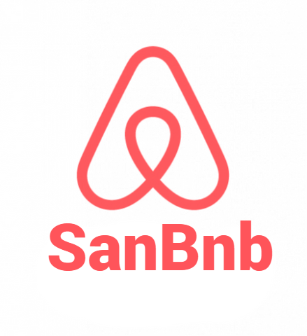
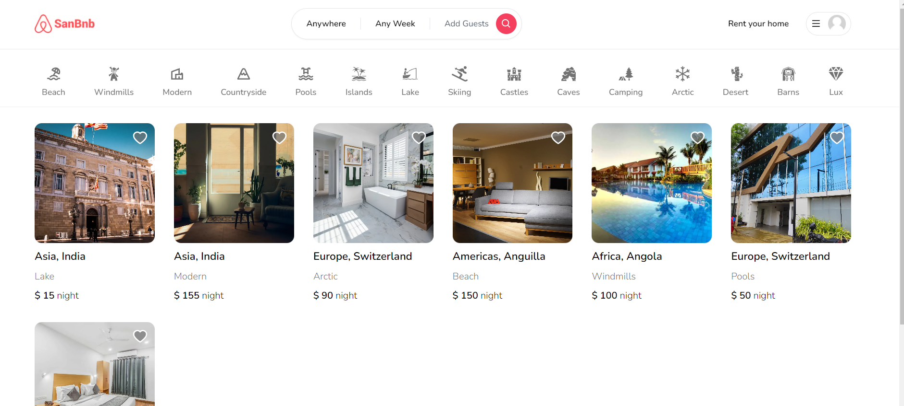

<div align="center">

  
  
# Airbnb Clone with Next.js 13!
  
  <p>
Full Stack Airbnb Clone with Next.js 13 Tailwind-css, Prisma, MongoDB, NextAuth, Framer-motionSocial, Login (Google and Facebook), Image upload, Cloudinary CDN, Location selection, Map component, Country autocomplete, Fetching listings with server components.
  </p>
  
<!-- Badges -->
<a href="https://residencybook.vercel.app" target="_blank"></a>


<h4>
    <a href="https://residencybook.vercel.app/">View Demo</a>
  <span> · </span>
    <a href="https://github.com/Sanjay0712/AirBnb-Clone/blob/master/README.md">Documentation</a>
  <span> · </span>
    <a href="https://github.com/Sanjay0712/AirBnb-Clone/issues">Report Bug</a>
  <span> · </span>
    <a href="https://github.com/Sanjay0712/AirBnb-Clone/issues">Request Feature</a>
  </h4>
</div>

<br />

<!-- Table of Contents -->

## :notebook_with_decorative_cover: Table of Contents

- [About the Project](#star2-about-the-project)
  - [Screenshots](#camera-screenshots)
  - [Tech Stack](#space_invader-tech-stack)
  - [Environment Variables](#key-environment-variables)
- [Getting Started](#toolbox-getting-started)
  - [Prerequisites](#bangbang-prerequisites)
  - [Installation](#gear-installation)
  - [Run Locally](#running-run-locally)
  - [Deployment](#triangular_flag_on_post-deployment)
- [Contact](#handshake-contact)

<!-- About the Project -->


## :star2: About the Project

Introducing "SanBnb" - Your All-in-One Vacation Rental Platform

SanBnb is a cutting-edge full-stack application that mirrors the functionality of Airbnb, providing an exceptional user experience for both travelers and property owners alike. With robust sign-up and login features, seamless integration of Next.js 13 as the client and server, MongoDB as the database, and Prisma for efficient data management, SanBnb revolutionizes the vacation rental industry.

Effortless Sign-Up and Login:

SanBnb simplifies the onboarding process for users through various authentication options. With Next OAuth, Google, and GitHub authentication, users can sign up and log in securely using their existing accounts, streamlining the registration process and enhancing user convenience.

Intuitive Next.js 13 Client and Server:

SanBnb utilizes the latest version of Next.js to provide a seamless user interface and enhanced performance. Leveraging the power of server-side rendering, SanBnb ensures fast loading times, optimal responsiveness, and an immersive browsing experience. Users can easily navigate through the platform, search for properties, and manage their bookings effortlessly.

Secure and Scalable MongoDB Database:

SanBnb leverages the power of MongoDB, a robust NoSQL database, to store and manage user data securely. With its flexible document-oriented structure, MongoDB enables efficient data retrieval, storage, and manipulation, ensuring a seamless experience for both users and hosts. SanBnb's database architecture is designed to scale effortlessly as the platform grows, accommodating a large volume of users and properties.

Efficient Data Management with Prisma:

SanBnb integrates Prisma, a powerful database toolkit, to streamline data management processes. Prisma's intuitive ORM (Object-Relational Mapping) simplifies database interactions, allowing developers to write cleaner and more maintainable code. With Prisma, SanBnb ensures efficient querying, seamless data synchronization, and enhanced data security.

Seamless Booking and Property Management:

SanBnb offers a comprehensive range of features for both travelers and property owners. Users can effortlessly search for their ideal living spot using advanced filters, view detailed property listings, and make bookings securely within the platform. Property owners can easily list their properties, manage bookings, set pricing and availability, and communicate with guests using SanBnb's intuitive interface.

Responsive Customer Support:

SanBnb takes pride in providing exceptional customer support. Our dedicated team is available to assist users with any queries or concerns they may have, ensuring a smooth and hassle-free experience. Whether you need assistance with bookings, property management, or technical support, we are committed to providing prompt and reliable customer service.

Discover Your Perfect Getaway with SanBnb:

Whether you're planning a weekend escape or looking to list your property for rent, SanBnb is your go-to platform for vacation rentals. Join our vibrant community of travelers and property owners today and experience the convenience, reliability, and excitement that SanBnb has to offer. Book your dream accommodation or start earning by renting out your property with SanBnb, the ultimate vacation rental solution.

<!-- Screenshots -->

### :camera: Screenshots

- Reservation functionality & Description and Price, Listing creation, Listing card component

<div align="center">
<a href="https://residencybook.vercel.app"></a>
</div>

<br />

- Searching functionality Favorite functionality, Individual Listing View, Listing reservation component

<div align="center">
<a href="https://residencybook.vercel.app"></a>
</div>

<br />
<br />

## :star2: Features

- Tailwind design
- Tailwind animations and effects
- Full responsiveness
- Credential authentication
- Google authentication
- Github authentication
- Image upload using Cloudinary CDN
- Client form validation and handling using react-hook-form
- Server error handling using react-toast
- Calendars with react-date-range
- Page loading state
- Page empty state
- Booking / Reservation system
- Guest reservation cancellation
- Owner reservation cancellation
- Creation and deletion of properties
- Pricing calculation
- Advanced search algorithm by category, date range, map location, number of guests, rooms and bathrooms
    - For example we will filter out properties that have a reservation in your desired date range to travel
- Favorites system
- Shareable URL filters
    - Lets say you select a category, location and date range, you will be able to share URL with a logged out friend in another browser and they will see the same results
- POST and DELETE routes in route handlers (app/api)
- Fetch data in server react components by directly accessing database (WITHOUT API! like Magic!)
- Handle files like error.tsx and loading.tsx which are new Next 13 templating files to unify loading and error handling
- Handle relations between Server and Child components!


## <a href="https://residencybook.vercel.app" target="_blank">LIVE DEMO 💥</a>


### :space_invader: Tech Stack

<details>
  <summary>Client</summary>
  <ul>
    <li><a href="https://#/">Typescript</a></li>
    <li><a href="https://nextjs.org/">Next.js</a></li>
    <li><a href="https://reactjs.org/">React.js</a></li>
    <li><a href="https://tailwindcss.com/">TailwindCSS</a></li>
    <li><a href="https://www.prisma.io">Prisma</a></li>
  </ul>
</details>

<details>
<summary>Database</summary>
  <ul>
  <li><a href="https://firebase.google.com">Mongodb</a></li>
  <li><a href="https://cloudinary.com/">Cloudinary</a></li>
  </ul>
</details>

<br />

<table>
    <tr>
        <td>
<a href="#"></a>
        </td>
                <td>
<a href="#"></a>
        </td>
                        <td>
<a href="#"></a>
        </td>
                              <td>
<a href="#"></a>
        </td>
                        <td>
<a href="#"></a>
        </td>
                                <td>
<a href="#"></a>
        </td>
                                      <td>
<a href="#"></a>
        </td>
      <td>
<a href="#"></a>
        </td>
        <td>
<a href="#"></a>
        </td>
    </tr>
</table>


## :toolbox: Getting Started

### :bangbang: Prerequisites

- Install Node JS in your computer <a href='https://nodejs.org/en/'>HERE</a>
- Sign up for a Cloudinary account <a href='https://cloudinary.com/'>HERE</a>
- Sign up for a Google Cloud Platform <a href='https://console.cloud.google.com/'>HERE</a>
- Sign up for a Meta for Developers <a href='https://developers.facebook.com'>HERE</a>
- Get Lookup APi Key <a href='https://extreme-ip-lookup.com/'>HERE</a>

<!-- Env Variables -->

### :key: Environment Variables

To run this project, you will need to add the following environment variables to your .env file

`DATABASE_URL`

`GOOGLE_CLIENT_ID`

`GOOGLE_CLIENT_SECRET`

`GITHUB_ID`

`GITHUB_SECRET`

`NEXTAUTH_SECRET`

`NEXTAUTH_URL`

`NEXT_PUBLIC_CLOUDINARY_CLOUD_NAME`

`NEXT_PUBLIC_LOOKUP_KEY`


This project was bootstrapped with [Create React App](https://github.com/facebook/create-react-app).

### :gear: Installation


Install my-project with npm

```
npx create-next-app@latest my-project --typescript --eslint
```

```
cd my-project
```

Install dependencies

### :test_tube: Install Tailwind CSS with Next.js

#### Install Tailwind CSS


Install tailwindcss and its peer dependencies via npm, and then run the init command to generate both `tailwind.config.js` and `postcss.config.js`.

```
npm install -D tailwindcss postcss autoprefixer
```

```
npx tailwindcss init -p
```

#### Configure your template paths

Add the paths to all of your template files in your `tailwind.config.js` file.
<br>

```js
/** @type {import('tailwindcss').Config} */
module.exports = {
  content: [
    "./app/**/*.{js,ts,jsx,tsx}",
    "./pages/**/*.{js,ts,jsx,tsx}",
    "./components/**/*.{js,ts,jsx,tsx}",
 
    // Or if using `src` directory:
    "./src/**/*.{js,ts,jsx,tsx}",
  ],
  theme: {
    extend: {},
  },
  plugins: [],
}
```

#### Add the Tailwind directives to your CSS

Add the `@tailwind` directives for each of Tailwind’s layers to your `./styles/globals.css` file.

```css
@tailwind base;
@tailwind components;
@tailwind utilities;
```

Install dependencies

<a href="https://github.com/Sanjay0712/AirBnb-Clone/blob/master/package.json" target="_blank">🔶 Dependency Info</a>

<!-- Run Locally -->

### :running: Run Locally


Clone the project

```bash
  git clone https://github.com/Sanjay0712/AirBnb-Clone.git
```

change directory

```bash
  cd AirBnb-Clone
```

Install dependencies

```bash
  npm install
```

Start the server

```bash
  npm run dev
```

<hr />

This is a [Next.js](https://nextjs.org/) project bootstrapped with [`create-next-app`](https://github.com/vercel/next.js/tree/canary/packages/create-next-app).

<hr />

Open [http://localhost:3000](http://localhost:3000) with your browser to see the result.

You can start editing the page by modifying `pages/index.js`. The page auto-updates as you edit the file.

[API routes](https://nextjs.org/docs/api-routes/introduction) can be accessed on [http://localhost:3000/api/hello](http://localhost:3000/api/hello). This endpoint can be edited in `pages/api/hello.js`.

The `pages/api` directory is mapped to `/api/*`. Files in this directory are treated as [API routes](https://nextjs.org/docs/api-routes/introduction) instead of React pages.

### Learn More

To learn more about Next.js, take a look at the following resources:

- [Next.js Documentation](https://nextjs.org/docs) - learn about Next.js features and API.
- [Learn Next.js](https://nextjs.org/learn) - an interactive Next.js tutorial.

You can check out [the Next.js GitHub repository](https://github.com/vercel/next.js/) - your feedback and contributions are welcome!

<!-- Deployment -->

### :triangular_flag_on_post: Deployment

To deploy this project run

##### Deploy on Vercel


The easiest way to deploy your Next.js app is to use the [Vercel Platform](https://vercel.com/new?utm_medium=default-template&filter=next.js&utm_source=create-next-app&utm_campaign=create-next-app-readme) from the creators of Next.js.

Check out our [Next.js deployment documentation](https://nextjs.org/docs/deployment) for more details.

## :handshake: Contact

Sanjay - sanjaydevan07@gmail.com

Project Link: [https://github.com/Sanjay0712/AirBnb-Clone.git](https://github.com/Sanjay0712/AirBnb-Clone.git)

<br />

<div align="center">
<a href="https://residencybook.vercel.app"></a>
</div>

<br />

<div align="center">Don't forget to leave a star ⭐️</div>
